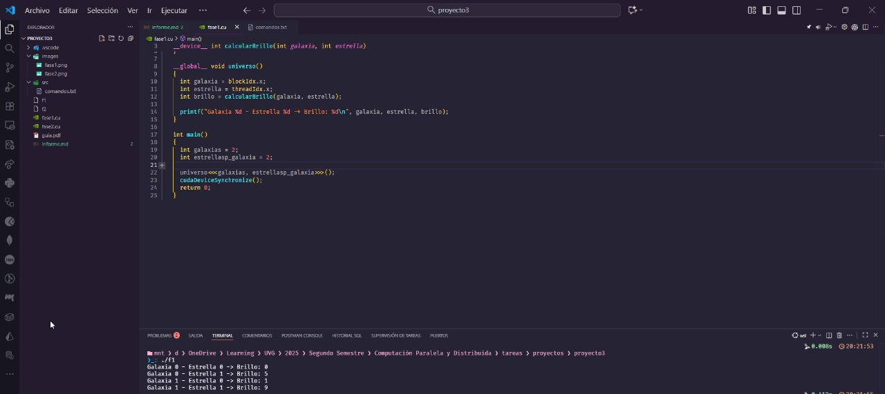
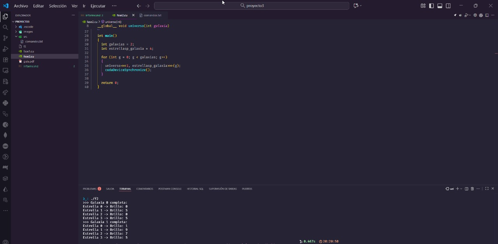
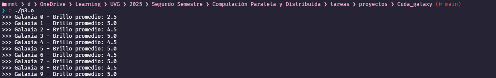

# Proyecto 3

## Integrantes

- **Guía conceptual - Brandon Reyes**
- **Analista - Carlos Valladares**
- **Programador principal - Josué Say**

## Enlaces

- [Enlace repositorio](https://github.com/BrandonReyes0609/Cuda_galaxy.git)

## Fase 1

1. Define cuántas galaxias tendrá tu universo (bloques) y cuántas estrellas hay por galaxia (hilos).
   - **Por defecto 4 galaxiaas con 3 estrellas**

2. Cada estrella debe calcular su propio brillo (un número entre 0 y 9) y mostrar en consola algo similar a:

    - Galaxia 0 - Estrella 0 -> Brillo: 7
    - Galaxia 0 - Estrella 1 -> Brillo: 2
    - Galaxia 1 - Estrella 0 -> Brillo: 4
    - Galaxia 1 - Estrella 1 -> Brillo: 9

   

3. Analiza visualmente el orden de impresión: ¿es secuencial o aleatorio?

   - El orden de impresión parece ser aleatorio porque no aparece en el orden de galaxias 0 -> 4, aparecen aleatoriamente.

### Preguntas de validación

1. **¿Qué relación existe entre blockIdx.x y el número de galaxia impreso?**

   blockIdx es directamente el número de galaxias, donde cada bloque representa una galaxia y el índice x corresponde al número que se imprime, por ejemplo si colocamos 4 galaxias, CUDA crea bloques del 0 al 3.

2. **¿Qué representa threadIdx.x dentro de tu simulación?**

   threadIdx.x representa el número de estrellas dentro de cada galaxia, los hilos comparten la misma galaxia (blockIdx.x) pero tienen distinto índice de estrella.

3. **Si duplicas la cantidad de estrellas, ¿cambia el orden de impresión o solo el tamaño de la salida?**

   Al duplicar la cantidad de estrellas únicamente cambia el tamaño de salida, pero el orden de impresión real sigue siendo el mismo porque el comportamiento sigue siendo el mismo.

4. **¿Qué representa el “brillo” dentro de este modelo paralelo?**

   El brillo es un cálculo que hace cada hilo de manera independiente, el brillo prácticamente simboliza el output independiente que cada hilo hace al ejecutar la misma función pero con distintos índices.

## Fase 2

Instrucciones

1. Introduce un mecanismo de sincronización para que las estrellas esperen entre sí antes de imprimir.

2. Logra que cada galaxia imprima sus estrellas juntas, como si todas brillaran al mismo tiempo.

3. Resultado esperado:

   ```bash
   Resultado esperado
   >>> Galaxia 0 completa:
   Estrella 0 -> Brillo 4
   Estrella 1 -> Brillo 9
   Estrella 2 -> Brillo 3
   Estrella 3 -> Brillo 1
   >>> Galaxia 1 completa:
   Estrella 0 -> Brillo 7
   Estrella 1 -> Brillo 2
   Estrella 2 -> Brillo 5
   Estrella 3 -> Brillo 6
   ```

   

### Preguntas de validación

1. **¿Qué ocurre si eliminas la sincronización?**

   Las estrellas se imprimirán en desorden, intercaladas con las demás galaxias, perderíamos la cohesión del bloque.

2. **¿Qué significa que `__syncthreads()` solo sincroniza dentro de un bloque?**

   Significa que solo coordina *estrellas dentro de la misma galaxia* pero no puede detener ni coordinar estrellas que pertenecen a otros bloques.

3. **¿Por qué la sincronización entre galaxias (bloques diferentes) no es posible directamente?**

   CUDA no permite sincronizar bloques dentro de un mismo kernel porque cada bloque puede ejecutarse en cualquier SM, en cualquier orden y en diferentes momentos.

4. **¿Qué tipo de errores podrían aparecer si las estrellas imprimen sin coordinarse?**

   - Impresiones mezcladas o en orden aleatorio
   - Valores incompletos o escritos demasiado pronto (en el caso de galaxias saldría primero)
   - Resultados visualmente caóticos
   - Se vuelve imposible interpretar el brillo de cada galaxia

## Fase 3

1. Crea una memoria compartida dentro de cada bloque donde las estrellas almacenen sus brillos.

2. Una vez que todos hayan calculado su valor, coordina que solo una estrella (por ejemplo, la de índice 0) calcule y muestre el promedio general del bloque.

3. Presenta el resultado así:

   ```bash
   >>> Galaxia 0 - Brillo promedio: 5.6
   >>> Galaxia 1 - Brillo promedio: 8.1
   >>> Galaxia 2 - Brillo promedio: 3.4
   ```

4. Muestra cuál galaxia es la más brillante (mayor promedio).

   

   

### Preguntas de validación

1. **¿Por qué es útil la memoria compartida en este contexto?**

   La memoria compartida es útil ya que permite de que todas las estrellas (que serían los hilos) dentro de una galaxia (el bloque) trabajen con un espacio común de datos.

2. **¿Qué ventaja tiene frente al uso de memoria global?**

   Son dos grandes ventajas respecto a la memoria global, velocidad muchísimo mayor y menor latencia y mayor coherencia, la memoria compartida hace que el cálculo del promedio sea mucho más rápido, ordenado y eficiente mientras que si lo hacemos en memoria global sería mucho más lento y con más riesgo de incoherencia.

3. **¿Qué pasaría si más de una estrella intenta escribir al mismo tiempo en la misma posición?**

   Si más de una estrella intenta escribir al mismo tiempo en la misma posición los valores se sobrescriben de manera impredecible, además que el resultado final depende del hilo que escribió más rápido y se genera un comportamiento no determinista y difícil de depurar, entonces el promedio final sería incorrecto o incoherente. Prácticamente si dos hilos están escribiendo en la misma posición sin coordinación sería igual a un dato corrupto.

4. **¿Qué refleja el promedio del brillo respecto al comportamiento de la GPU?**

   Refleja la cooperación de los hilos entre ellos en un mismo bloque, prácticamente el promedio del brillo simboliza cómo la GPU combina trabajo paralelo para reducir un resultado global por bloque.

## Fase 4

### Brandon Reyes

1. **¿Qué aprendiste sobre cómo CUDA distribuye el trabajo entre hilos y bloques?**

   Entendí que CUDA divide el trabajo en bloques y dentro de cada bloque los hilos se encargan de los cálculos. Cada quien hace su parte sin depender de los demás.

2. **¿Qué fue lo más difícil de entender del paralelismo?**

   Me costó aceptar que las cosas no tienen un orden fijo y que todo corre al mismo tiempo. Eso al inicio se siente raro porque uno espera que todo vaya en secuencia.

3. **Si pudieras mejorar el laboratorio, ¿qué cambio harías en el algoritmo?**

   Tal vez agregar una parte donde cada galaxia tenga un comportamiento diferente, algo que no sea tan repetitivo.

4. **¿Qué analogía del mundo real usarías para explicar el concepto de “sincronización de hilos”?**

   Como cuando varios cocineros preparan un plato, pero no se puede servir hasta que todos terminen su parte.

5. **¿Cómo verificarías que realmente se está ejecutando en GPU y no en CPU?**

   Revisaría nvidia-smi y también vería si el kernel aparece corriendo. Si la GPU sube de uso, entonces sí está funcionando.

### Josue Say

1. **¿Qué aprendiste sobre cómo CUDA distribuye el trabajo entre hilos y bloques?**

   Aprendí que CUDA asigna bloques a diferentes multiprocesadores y dentro de cada uno ejecuta muchos hilos en paralelo. La estructura está pensada para dividir problemas grandes en tareas pequeñas.

2. **¿Qué fue lo más difícil de entender del paralelismo?**

   Lo que más me costó fue comprender cómo se coordinan los hilos y por qué no se pueden sincronizar bloques completos. También la idea de que el orden de salida nunca es determinista.

3. **Si pudieras mejorar el laboratorio, ¿qué cambio harías en el algoritmo?**

   Implementaría una reducción más eficiente y también permitiría comparar el comportamiento entre diferentes configuraciones de hilos y bloques.

4. **¿Qué analogía del mundo real usarías para explicar el concepto de “sincronización de hilos”?**

   La compararía con un semáforo peatonal: todos esperan la luz verde para moverse exactamente al mismo tiempo.

5. **¿Cómo verificarías que realmente se está ejecutando en GPU y no en CPU?**

   Usaría cudaGetDeviceProperties, mediría tiempos de ejecución y verificaría uso de la GPU en nvidia-smi.

### Carlos Valladares

1. **¿Qué aprendiste sobre cómo CUDA distribuye el trabajo entre hilos y bloques?**

   Aprendí a que cada bloque es como una unidad grande de trabajo y cada hilo hace una parte pequeña del cálculo, repartiendo esos bloques entre la GPU y cada hilo trabaja en paralelo con su propio índice.

2. **¿Qué fue lo más difícil de entender del paralelismo?**

   Lo más difícil de entender fue que el orden no está garantizado y que todos los hilos trabajan simultaneamente, y entender que solo se pueden sincronizar hilos dentro del mismo bloque.

3. **Si pudieras mejorar el laboratorio, ¿qué cambio harías en el algoritmo?**

   Agregaría una parte donde las galaxias puedan compararse entre ellas usando una reducción global o una visualización para ver los brillos de forma más clara.

4. **¿Qué analogía del mundo real usarías para explicar el concepto de “sincronización de hilos”?**

   El mejor ejemplo sería cuando en clase todos deben terminar un ejercicio antes de continuar con otro, no importa que unos terminen rápido y otros lento, nadie va avanzar hasta que todos estén listos.

5. **¿Cómo verificarías que realmente se está ejecutando en GPU y no en CPU?**

   Revisando nvidia-smi y usando cudaGetDeviceProperties comparando los tiempos con una versión de CPU y verificando que el kernel se lance sin errores desde la GPU.

### Respuestas conjuntas

1. **¿Qué aprendiste sobre cómo CUDA distribuye el trabajo entre hilos y bloques?**

   Como grupo llegamos a la conclusión de que CUDA organiza el trabajo dividiéndolo en bloques y dentro de cada bloque en hilos. Esto permite repartir tareas grandes en muchas tareas pequeñas que se ejecutan al mismo tiempo. También entendimos que cada hilo usa su propio índice para calcular algo diferente y que los bloques se distribuyen entre los multiprocesadores de la GPU.

2. **¿Qué fue lo más difícil de entender del paralelismo?**

   Coincidimos en que lo más complicado fue acostumbrarnos a que no existe un orden fijo y que los hilos ejecutan su trabajo simultáneamente. Además, todos tuvimos dificultades al inicio para entender por qué únicamente se pueden sincronizar hilos dentro de un mismo bloque y no entre bloques completos.

3. **Si pudieras mejorar el laboratorio, ¿qué cambio harías en el algoritmo?**

   Como grupo pensamos que sería útil agregar una parte donde las galaxias puedan compararse entre sí o mostrar alguna visualización del comportamiento de los brillos. También consideramos que sería interesante implementar una reducción global o probar diferentes configuraciones de hilos y bloques para ver cómo cambia el rendimiento.

4. **¿Qué analogía del mundo real usarías para explicar el concepto de “sincronización de hilos”?**

   Llegamos a la analogía de que la sincronización es como cuando un grupo de personas tiene que esperar a que todos estén listos para seguir con la siguiente actividad. No importa si unos terminan antes y otros después, nadie puede avanzar hasta que todos estén preparados.

5. **¿Cómo verificarías que realmente se está ejecutando en GPU y no en CPU?**

   Como grupo concluimos que los métodos más confiables son revisar el uso de la GPU con nvidia-smi, comprobar las propiedades del dispositivo con cudaGetDeviceProperties, y comparar la velocidad del programa frente a una versión que corra en CPU. Si el kernel aparece ejecutándose y la GPU muestra actividad, significa que sí está corriendo en la GPU.
